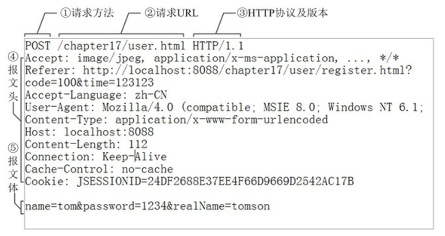

# Cookie与Session的区别和联系
### Session

**由来**
本来 session 是一个抽象概念，开发者为了实现中断和继续等操作，将 user agent 和 server 之间一对一的交互，抽象为“会话”，进而衍生出“会话状态”，也就是 session 的概念。

**设计动机**

由于HTTP协议是无状态的协议，所以服务端需要记录用户的某种状态时，就需要用机制来识具体的用户，这个机制就是Session。

**应用场景举例**

典型的场景比如购物车，当你点击下单按钮时，由于HTTP协议无状态，所以并不知道是哪个用户操作的，所以服务端要为特定的用户创建了特定的Session，用用于标识这个用户，并且跟踪用户，这样才知道购物车里面有几本书。这个Session是保存在服务端的，有一个唯一标识。

**存在形式**

在服务端保存Session的方法很多，内存、数据库、文件（持久化）都有。集群的时候也要考虑Session的转移，在大型的网站，一般会有专门的Session服务器集群，用来保存用户会话，这个时候Session信息都是放在内存的，使用一些缓存服务比如Memcached之类的来放Session。

**实现方法**

每次HTTP请求的时候，客户端都会发送相应的Cookie信息到服务端。实际上大多数的应用都是用 Cookie 来实现Session跟踪的，第一次创建Session的时候，服务端会在HTTP协议中告诉客户端，需要在 Cookie 里面记录一个Session ID，以后每次请求把这个会话ID发送到服务器，我就知道你是谁了。有人问，如果客户端的浏览器禁用了 Cookie 怎么办？一般这种情况下，会使用一种叫做URL重写的技术来进行会话跟踪，即每次HTTP交互，URL后面都会被附加上一个诸如 sid=xxxxx 这样的参数，服务端据此来识别用户。

### Cookie

**存在形式**

cookie是一个实际存在的东西，http协议中定义在header中的字段。

**session cookie与persistent cookie**

session cookie针对某一次会话而言，会话结束session cookie也就随着消失了，而persistent cookie只是存在于客户端硬盘上的一段文本（通常是加密的），而且可能会遭到cookie欺骗以及针对cookie的跨站脚本攻击，自然不如 session cookie安全

**作用**

客户端保存用户信息的一种机制。
